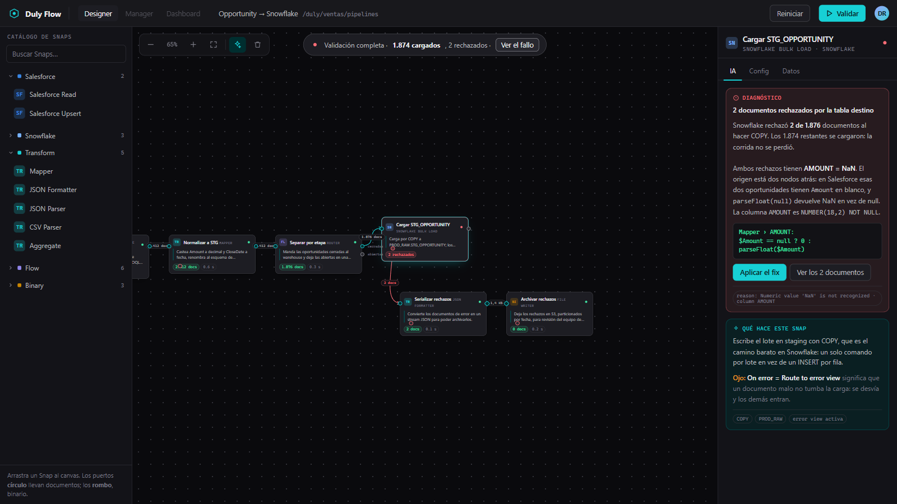
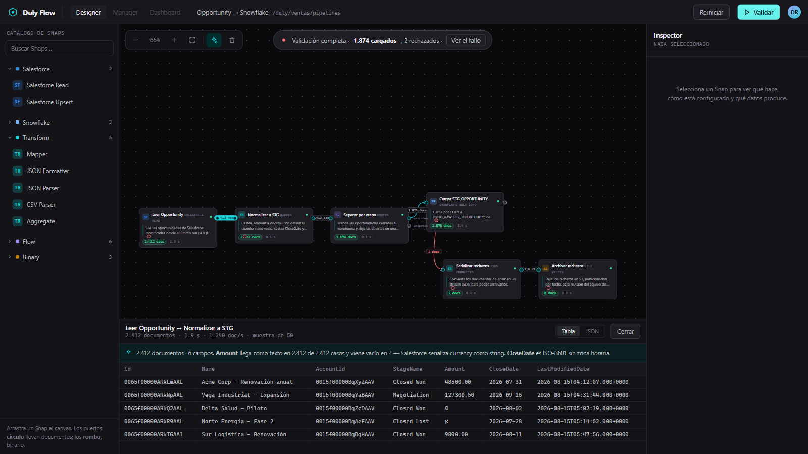

# Duly Flow — rediseño de SnapLogic Designer

Reconstrucción propia del canvas de integración, en dark mode Duly, con explicación
de IA como parte de la anatomía del nodo. Cierra (en prototipo) el gap
`WorkflowCanvasFrame` marcado ❌ en `NORTH_STAR.md` — que no puede resolverse
embebiendo n8n porque su plan OEM no permite white-label (nota del 2026-07-02).

**Entregable:** [`duly-flow.html`](./duly-flow.html) — un solo archivo, vanilla JS,
sin build ni dependencias. Se abre con doble clic.

## Decisiones

| Decisión | Elegido |
|---|---|
| Fidelidad | Rediseño libre: conserva el modelo mental y el vocabulario de SnapLogic (Snap, pipeline, views, preview, error view), no su layout ni su forma de nodo |
| Caso de uso | Salesforce → Snowflake, carga incremental de `Opportunity` |
| IA en nodos | Las 4 capacidades: explicar el nodo, diagnosticar el fallo, describir la forma de los datos, sugerir el siguiente paso |
| Formato | HTML standalone |

## La tesis

**El nodo se explica solo.** La pieza de puzzle desaparece; el nodo lleva una línea
de docstring en lenguaje natural siempre visible. El canvas se lee como una frase,
no como un diagrama de circuito. SnapGPT explica el pipeline en un panel de chat
*lejos* del canvas — acá la explicación vive *sobre* el nodo.

**Regla de ruido: una sola superficie de IA habla sin que se lo pidan** (el docstring).
El resto se dispara por selección, por resultado de ejecución o por hover.

| Capacidad | Superficie | Disparador |
|---|---|---|
| Qué hace este nodo | Docstring en el nodo | Siempre visible (ambiente) |
| Por qué falló | Chip de error en el nodo + tab IA del inspector | Post-ejecución, solo si falló |
| Forma de los datos | Chip de conteo en la arista → panel de preview | Clic en el chip de la arista |
| Siguiente paso | Nodo fantasma punteado a la derecha | Seleccionar un nodo con salida libre |

## Qué se conserva de SnapLogic

- Vocabulario: Snap, Snap Pack, pipeline, views (input/output/error), preview de datos,
  Snaplex, expression language con `$`.
- Codificación de puertos por forma: **círculo = documento**, **rombo = binario** —
  solo conectan formas iguales. Es genuinamente bueno.
- Error view como tercer socket, ruteable a otro Snap sin detener el pipeline.
- Shape del documento de error: `error / reason / resolution / stacktrace / original`.
- Telemetría por view: Documents, Duration, Rate.

## Qué se corta a propósito

Modal de settings (era un pain point documentado — va al inspector lateral), clon del
panel de chat de SnapGPT, minimapa, undo/redo, multi-select, versiones/compare/print.
Manager y Dashboard son tabs inertes.

## Honestidad sobre la IA

Los textos de IA son **strings pre-escritos indexados por (nodo, estado)**. La UI es
real y funciona; la inteligencia está guionada. Es lo correcto para una v1: define el
contrato de qué debe producir el modelo en cada superficie, sin gastar en cablearlo.

## Qué funciona (verificado en navegador)

1. Arrastrar un Snap de la paleta al canvas — cae donde sueltas
2. Arrastrar un Snap ya puesto — se mueve y las aristas lo siguen
3. Clic en un Snap — lo selecciona y abre el inspector
4. Arrastrar salida → entrada — crea la conexión
5. Conexión incompatible (documento → binario) — se rechaza con aviso
6. Eliminar Snap o conexión — el Snap se lleva sus aristas
7. Pan arrastrando el fondo
8. Zoom con rueda, botones, ajuste a pantalla y teclas `+` `−` `F`
9. **Validar** — corrida guionada: los nodos pasan por los 6 estados en orden,
   las aristas se animan y aparecen los conteos
10. Preview por arista — Tabla/JSON, con los valores rotos marcados
11. IA por nodo — docstring, diagnóstico del fallo, forma de los datos, sugerencia

El archivo trae un `selfCheck()` que corre al cargar y valida la integridad del grafo
en consola (`[selfCheck] ok`).

## Fuentes

Investigación previa sobre la anatomía de la UI actual, las features de IA de SnapLogic
(SnapGPT, AgentCreator, AutoSuggest) y los patrones de "AI explain" de n8n, Make,
Workato, Retool, LangGraph Studio, Dify y Dagster.

Dato relevante que salió de ahí: **AutoSuggest no usa LLM** — SnapLogic lo dice
explícitamente. Es un recomendador ML clásico. SnapGPT (generativo) es un subsistema
aparte, y vive en un panel de chat lateral, nunca sobre el canvas.
